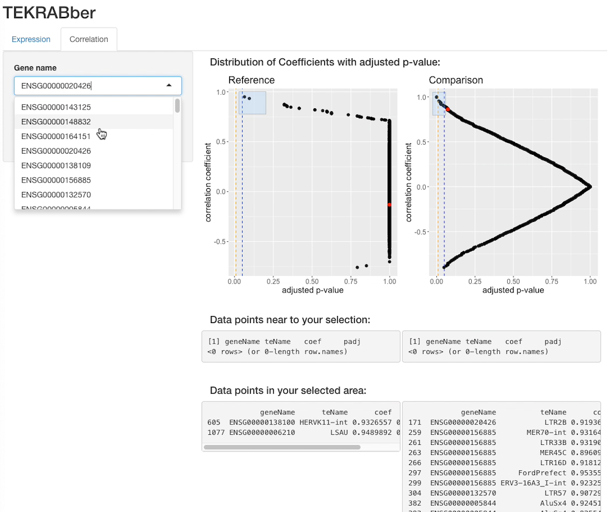

## TEKRABber

TEKRABber is mainly made for estimating correlations comparing orthologs and transposable elements (TEs) between two species. It considers the orthology confidence from BioMart to normalize expression counts and detect differentially expressed orthologs/ TEs. It can also perform differentially expressed genes/TEs analysis and you have a first insight by visualizing your result via an app function (see below). Comparing orthologs and TEs from the same species is also applicable.

## Introduction

The name of TEKRABber comes from the idea that the largest group of transcription factors, Krüppel-associated box (KRAB) domain-containing zinc-finger play a role as a grabber of transposable elements (TEs). The aim of developing TEKRABber is to provide a user-friendly tool to estimate the correlations in selected orthologs and transposable elements between two selected species. It takes the advantage by using the orthology information to normalize expression counts, setting one species as a reference and the other as a compare one. It can also be used to compare control and treatment data within the same species. TEKRABber also provides an app function to help users have a quick view of their results.

<p align="center">



</p>

## User's Guide

You can download TEKRABber using `BiocManager::install()`:

``` r
if (!requireNamespace("BiocManager", quietly = TRUE))
    install.packages("BiocManager")

BiocManager::install("TEKRABber")
```

or download directly from github repo:

``` r
devtools::install_github("ferygood/TEKRABber")
```

Find detailed information in `vignettes/TEKRABber.Rmd`

## Citation

If you are using TEKRABber in your publication, please cite:

Chen Yao-Chung, Maupas Arnaud, Nowick Katja (2025) Regulatory networks of KRAB zinc finger genes and transposable elements changed during human brain evolution and disease eLife 14:RP103608

<https://doi.org/10.7554/eLife.103608.1>

## Contact

email: [yao-chung.chen\@fu-berlin.de](mailto:yao-chung.chen@fu-berlin.de){.email}
